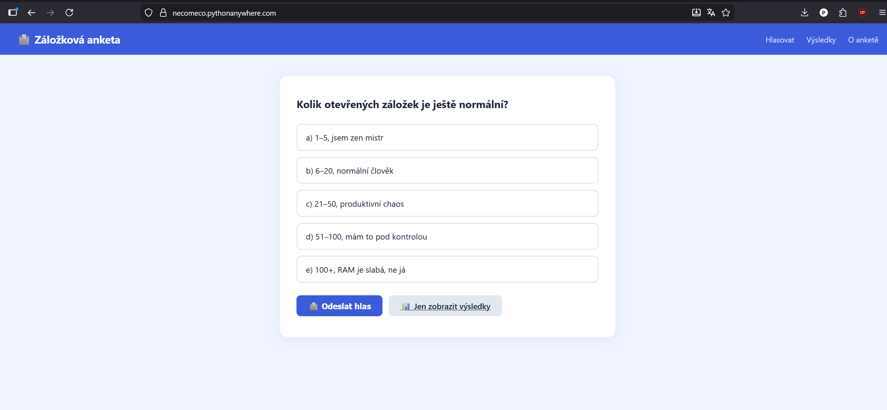

# Záložková anketa – technická dokumentace

## 1. Úvod a přehled projektu

Záložková anketa je jednoduchá webová aplikace, která zjišťuje odpověď na otázku:

> „Kolik otevřených záložek je ještě normální?“

Aplikace je navržená jako školní projekt pro demonstraci:

- server‑side webové aplikace v Pythonu (framework **Flask**),
- práce se šablonami (**Jinja2**),
- ukládání dat do souboru **JSON**,
- nasazení jednoduché aplikace na **PythonAnywhere**,
- základní ochrany proti vícenásobnému hlasování pomocí **session**.

Uživatel hlasuje přes jednoduché HTML rozhraní, výsledky jsou sdílené mezi všemi uživateli a ukládají se na serveru do souboru `votes.json`. Aplikace je snadno konfigurovatelná přes soubor `config.ini`.

---

## 2. Funkcionality

Hlavní funkcionality aplikace:

- Zobrazení otázky a 5 předdefinovaných odpovědí (radio buttony).
- Uložení **maximálně jednoho hlasu** od daného uživatele (omezujeme vícenásobné hlasování pomocí session).
- Zobrazení aktuálních výsledků:
  - počet hlasů pro každou odpověď,
  - procentuální zastoupení,
  - grafické zobrazení pomocí „progress barů“.
- Zobrazení výsledků bez nutnosti hlasovat (samostatná stránka).
- Administrátorský reset všech hlasů pomocí tajného tokenu, který zároveň odblokuje možnost znovu hlasovat pro uživatele, jenž reset provedl; reset je dostupný přes skrytou administrátorskou stránku `/admin` .
- Informační stránka „O anketě“ s popisem projektu.


---

## 3. Požadavky na systém

### 3.1 Software

- **Python** 3.9+ (lokální vývoj; na PythonAnywhere použijte podporovanou verzi, např. 3.10).
- **pip** (součást většiny instalací Pythonu).
- Knihovna **Flask** (instaluje se z `requirements.txt`).
- Volitelně: **Git** pro správu verzí a nasazování.

### 3.2 Podporované prostředí

- Operační systémy: Windows, Linux, macOS (lokální vývoj).
- Hosting: PythonAnywhere (free účet).
- Webový prohlížeč: jakýkoli moderní browser podporující základní HTML/CSS.

---

## 4. Konfigurace

Aplikace je konfigurovatelná přes soubor `config.ini` v kořeni projektu. Základní nastavení:

```ini
[app]
data_file = votes.json
reset_token = tajny-token-2024
secret_key = dev-secret-key
```

- `data_file` – název JSON souboru, do kterého se ukládají hlasy.
- `reset_token` – tajný token pro reset hlasování (ověřuje se při POST `/reset`).
- `secret_key` – tajný klíč Flask aplikace pro session (používá se mj. pro blokaci vícenásobného hlasování).

Hodnoty v `config.ini` lze případně přepsat proměnnými prostředí:

- `RESET_TOKEN` – tajný token pro reset hlasování.
- `SECRET_KEY` – tajný klíč Flask aplikace pro session.

Pokud nejsou nastaveny ani v prostředí, ani v `config.ini`, použijí se výchozí hodnoty z ukázky výše.

### 5.1 Nastavení proměnných prostředí (lokálně)

#### Windows (PowerShell)

```powershell
$Env:RESET_TOKEN = "muj-tajny-reset-token"
$Env:SECRET_KEY = "muj-tajny-session-klic"
```

#### Linux / macOS (bash)

```bash
export RESET_TOKEN="muj-tajny-reset-token"
export SECRET_KEY="muj-tajny-session-klic"
```

### 4.2 Nastavení na PythonAnywhere

Na PythonAnywhere je možné proměnné nastavit dvěma způsoby:

1. **V rozhraní Web > Environment variables** (doporučeno):
   - `RESET_TOKEN = muj-tajny-reset-token`
   - `SECRET_KEY = muj-tajny-session-klic`
2. Nebo v WSGI souboru (méně preferované řešení):

   ```python
   import os
   os.environ['RESET_TOKEN'] = 'muj-tajny-reset-token'
   os.environ['SECRET_KEY'] = 'muj-tajny-session-klic'
   ```

---

## 5. Použití

### 5.1 Spuštění aplikace lokálně

Po instalaci závislostí a volitelné konfiguraci proměnných prostředí spusťte aplikaci:

```bash
python app.py
```

Výchozí adresa:

- <http://127.0.0.1:5000/>

### 5.2 Typický uživatelský scénář

1. Uživatel otevře hlavní stránku `/`.
2. Vybere jednu z 5 nabízených možností (radio button).
3. Odesláním formuláře:
   - se jeho hlas uloží do `votes.json`,
   - session se označí jako „už hlasoval“,
   - zobrazí se potvrzení a graf výsledků.
4. Uživatel může kdykoli přejít na `/results` a podívat se na výsledky bez dalšího hlasu.
5. Správce ankety může na administrátorské stránce `/admin` zadat tajný `RESET_TOKEN` a hlasování vynulovat; po úspěšném resetu může tento uživatel znovu hlasovat.
Fs

---

## 6. Příklady

### 6.1 Přístup k webové aplikaci

- Lokálně:  
  `http://127.0.0.1:5000/`

- Na PythonAnywhere (příklad):  
  `https://TVUJ-UZIVATEL.pythonanywhere.com/`

### 6.2 Příklad hlasování (uživatelský pohled)

1. Otevři `/`.
2. Vyber např. „c) 21–50, produktivní chaos“.
3. Klikni na **Odeslat hlas**.
4. Zobrazí se zpráva „Tvůj hlas byl uložen, díky!“ a graf výsledků.

### 6.3 Příklad zobrazení výsledků bez hlasování

- Otevři `/results` – zobrazí se stejný graf výsledků a tlačítko „Chci hlasovat“.

### 6.4 Příklad resetu hlasování

- Otevři adresu `/admin` (není v hlavním menu, musíš ji znát).
- Na stránce je sekce „Administrace – reset hlasování“.
- Po rozbalení zadej správný `RESET_TOKEN` a odešli formulář.
- Hlasy se vynulují a zobrazí se prázdné výsledky.
- Pro uživatele, který zadal správný token, se zruší blokace a může znovu hlasovat.


---

## 7. API dokumentace (HTTP endpointy)

Aplikace neposkytuje JSON REST API, ale má několik HTTP endpointů, které vrací HTML šablony. Tyto endpointy lze chápat jako jednoduché „webové API“ aplikace.

### 7.1 Přehled endpointů   

| Metoda | URL        | Popis                                                                                   |
|--------|------------|-----------------------------------------------------------------------------------------|
| GET    | `/`        | Zobrazí stránku s anketou. Pokud uživatel již hlasoval, zobrazí pouze výsledky.        |
| POST   | `/vote`    | Přijme hlas z formuláře, uloží ho a zobrazí výsledky.                                  |
| GET    | `/results` | Zobrazí aktuální výsledky bez možnosti hlasovat.                                       |
| GET    | `/admin`   | Zobrazí administrátorskou verzi výsledků se skrytou sekcí pro reset hlasování.        |
| POST   | `/reset`   | Resetuje hlasování na nuly. Vyžaduje platný `token` v těle požadavku.                  |
| GET    | `/about`   | Zobrazí informační stránku o projektu.                                                 |

### 7.2 Parametry endpointů

#### POST `/vote`

- **Form data**
  - `choice` – identifikátor zvolené možnosti (`"a"`, `"b"`, `"c"`, `"d"`, `"e"`).

#### POST `/reset`

- **Form data**
  - `token` – řetězec, který se porovnává s `RESET_TOKEN`; při úspěšném ověření se vynulují hlasy a pro danou session se odstraní příznak, že uživatel hlasoval. Formulář je dostupný pouze na stránce `/admin`.

---

## 8. Struktura projektu  

Výchozí struktura projektu:

```text
anketa/
├── app.py              # Hlavní Flask aplikace – veškerá logika
├── requirements.txt    # Python závislosti
├── votes.json          # Hlasy (vytvoří se automaticky při prvním hlasu)
├── templates/
│   ├── base.html       # Základní HTML layout (header, navigace, footer)
│   ├── index.html      # Hlavní stránka – hlasování + výsledky
│   └── about.html      # Stránka „O anketě“
└── README.md           # Tato dokumentace
```

### 8.1 `app.py`

- Definice Flask aplikace `app`.
- Konfigurace:
  - `DATA_FILE` – název souboru s hlasy (načten z `config.ini`).
  - `RESET_TOKEN` – hodnota pro ověření v route `/reset` (načten z `config.ini` nebo prostředí).
  - `SECRET_KEY` – klíč pro session (načten z `config.ini` nebo prostředí).
- Pomocné funkce:
  - `load_votes()` – načtení hlasů z JSON.
  - `save_votes(votes)` – uložení hlasů do JSON.
  - `total_votes(votes)` – výpočet celkového počtu hlasů.
- Route:
  - `/`, `/vote`, `/results`, `/admin`, `/reset`, `/about`.
- Ochrana proti vícenásobnému hlasování:
  - flag `session["voted"]`, kontrolovaný v route `/` a `/vote`; při úspěšném resetu v `/reset` se z aktuální session odstraní.

### 8.2 `templates/base.html`

Šablona s:

- HTML `<head>`, globálním CSS.
- horní lištou (název ankety + navigace),
- hlavním obsahem (``),
- patičkou.

### 8.3 `templates/index.html`

Obsahuje:

- vykreslení otázky a odpovědí,
- formulář pro hlasování (pokud `voted` je `False`),
- sekci s výsledky (bary, počty hlasů, procenta),
- sekci pro reset hlasování (hidden administrace).

### 8.4 `templates/about.html`

Informační stránka:

- popis projektu,
- technické informace,
- návod, jak hlásit chyby (kontakt na e‑mail).

### 8.5 `votes.json`

Soubor s perzistentním uložením hlasů ve formátu JSON. Typická struktura:

```json
{
  "a": 10,
  "b": 15,
  "c": 7,
  "d": 3,
  "e": 5
}
```

Vytváří se automaticky při prvním hlasu, pokud neexistuje.

---

## 9. Pokyny pro vývojáře

### 9.1 Lokální spuštění

1. Naklonuj repozitář.
2. (Volitelně) vytvoř a aktivuj virtualenv.
3. Nainstaluj závislosti:

   ```bash
   pip install -r requirements.txt
   ```

4. Nastav proměnné prostředí (`RESET_TOKEN`, `SECRET_KEY`) – viz sekce Konfigurace.
5. Spusť:

   ```bash
   python app.py
   ```


### 9.2 Nasazení na PythonAnywhere – stručný přehled

Detaily nasazení:

1. Přihlášení na PythonAnywhere, vytvoření adresáře (např. `~/anketa`).
2. Nahrání souborů přes **Files**.
3. Vytvoření virtualenv a instalace závislostí:

   ```bash
   mkvirtualenv anketa-venv --python=python3.10
   pip install -r /home/TVUJ-UZIVATEL/anketa/requirements.txt
   ```

4. V záložce **Web** vytvořit novou web app:
   - Manual configuration, Python 3.x.
5. Nastavit virtualenv a cestu ke kódu (`/home/TVUJ-UZIVATEL/anketa`).
6. Upravit config.ini soubor:

   ```txt
   [app]
   data_file = votes.json
   reset_token = tvuj-tajny-token
   secret_key = tvuj-tajny-session-klic
   ```

7. Kliknout na **Reload** a otevřít URL aplikace.

---

## 10. Licence

Tento projekt je primárně určen pro **školní/studijní účely**.

Pokud potřebuješ formální licenci:

- doporučená volba: **MIT License**,
- nebo jiná licence podle požadavků školy / zadání.

> Poznámka: pokud bude přidán soubor `LICENSE`, informace v této sekci by měly být upraveny tak, aby odpovídaly skutečné licenci projektu.

---
